<div align="center">


# CognivAgent

**Transform videos into searchable knowledge graphs**

<!-- TODO: Add hero screenshot showing the main interface -->
<!--  -->

[](https://www.python.org/downloads/)
[](https://github.com/costiash/agent-video-to-data/actions/workflows/ci.yml)
[](#development)
[](LICENSE)

Built with [Claude Agent SDK](https://github.com/anthropics/anthropic-sdk-python) and [OpenAI gpt-4o-transcribe](https://platform.openai.com/)

---

**[Quick Start](#-quick-start)** |
**[Features](#-features)** |
**[Screenshots](#-screenshots)** |
**[Documentation](#-documentation)** |
**[Contributing](#-contributing)**

</div>

---

## Important Disclaimers

### YouTube Content Policy

> **This project is NOT designed for downloading videos or audio from YouTube.**
>
> CognivAgent extracts **transcripts only** for analysis purposes. All video/audio content
> is **automatically deleted during runtime** after transcription completes.
>
> **Contributions that change this behavior will NOT be accepted.**

### Security Notice

> **This code is NOT ready for production deployment.**
>
> The application requires serious security analysis before being deployed beyond localhost.
>
> **Strong recommendation: Only run on localhost for development and research.**

---

## Quick Start

### One-Line Install

```bash
curl -fsSL https://raw.githubusercontent.com/costiash/agent-video-to-data/main/install.sh | bash
```

> **Security Note**: This pipes a remote script to your shell. We recommend [reviewing install.sh](install.sh) first, or using the Manual Install below.

### Manual Install

```bash
git clone https://github.com/costiash/agent-video-to-data.git
cd agent-video-to-data
uv sync

cp .env.example .env
# Add your API keys to .env:
#   ANTHROPIC_API_KEY=sk-ant-...
#   OPENAI_API_KEY=sk-...

uv run python -m app.main
# Open http://127.0.0.1:8000
```

### Docker

```bash
docker-compose up -d
# Open http://localhost:8000
```

See the [Docker Guide](guides/docker-deployment.md) for detailed deployment options.

---

## Features

| Feature | Description |
|---------|-------------|
| **Video Transcription** | Local videos and YouTube URLs via gpt-4o-transcribe with domain vocabulary prompts |
| **Knowledge Graphs** | Auto-bootstrap domain schemas, extract entities/relationships with source citations |
| **Entity Resolution** | Detect and merge duplicates using multi-signal similarity matching (Jaro-Winkler, alias overlap) |
| **Chat Interface** | Real-time activity streaming, Markdown rendering, dark/light themes |
| **Graph Visualization** | Interactive Cytoscape.js with search, type filtering, node inspector |
| **Transcript Library** | Save, search, export (TXT/JSON), and full-text viewer with highlighting |
| **Audit Trail** | Security blocking, tool usage logging, session lifecycle tracking |
| **Background Jobs** | Async queue with persistence, restart recovery, cancel/retry, step progress UI |

---

## Screenshots

### Chat Interface

Real-time conversation with the AI agent, featuring activity streaming and Markdown rendering.

| Dark Mode | Light Mode |
|:---------:|:----------:|
|  |  |

### Knowledge Graph Visualization

Interactive graph powered by Cytoscape.js with search, type filtering, and node inspector.

| Dark Mode | Light Mode |
|:---------:|:----------:|
|  |  |

### Transcript Library

Save, search, and export transcripts with full-text viewer and highlighting.

| Dark Mode | Light Mode |
|:---------:|:----------:|
|  |  |

---

## Demo Video

<div align="center">

https://github.com/user-attachments/assets/2b4d7f2e-edd0-43b5-8117-50464314be71

*5-minute full workflow: building a knowledge graph from multiple videos and querying it with agent skills*

</div>

---

## Knowledge Graph Workflow

```
Create Project  -->  Bootstrap  -->  Confirm Discoveries  -->  Extract  -->  Export
```

1. **Create** - Name your research topic
2. **Bootstrap** - First video auto-infers entity types and relationships
3. **Confirm** - Review and approve/reject discovered patterns
4. **Extract** - Subsequent videos use the confirmed schema
5. **Export** - Download as GraphML (Gephi, Neo4j, yEd) or JSON

---

## Architecture

```mermaid
%%{init: {'theme': 'base', 'themeVariables': { 'primaryColor': '#818cf8', 'primaryTextColor': '#1e1b4b', 'primaryBorderColor': '#6366f1', 'lineColor': '#94a3b8', 'secondaryColor': '#f8fafc', 'tertiaryColor': '#f1f5f9'}}}%%
graph TB
    subgraph Frontend["🖥️ Frontend"]
        UI[Web UI<br/>37 ES Modules]
    end

    subgraph API["⚡ FastAPI Layer"]
        R1[Chat Router]
        R2[KG Router]
        R3[Jobs Router]
        R4[Transcripts Router]
        R5[Audit Router]
    end

    subgraph Services["🔧 Services"]
        SS[SessionService]
        KS[KnowledgeGraphService]
        JS[JobQueueService]
        AS[AuditService]
    end

    subgraph Core["🧠 Core"]
        SA[SessionActor]
        AGENT[Claude Agent<br/>+ MCP Tools]
    end

    subgraph External["🌐 External"]
        CLAUDE[Claude API]
        OPENAI[OpenAI API<br/>gpt-4o-transcribe]
    end

    UI --> R1
    UI --> R2
    UI --> R3
    UI --> R4
    UI --> R5
    R1 --> SS
    R2 --> KS
    R3 --> JS
    R5 --> AS
    SS --> SA
    SA --> AGENT
    AGENT --> CLAUDE
    AGENT --> OPENAI

    classDef frontend fill:#dbeafe,stroke:#3b82f6,stroke-width:2px,color:#1e40af
    classDef api fill:#dcfce7,stroke:#22c55e,stroke-width:2px,color:#166534
    classDef services fill:#f3e8ff,stroke:#a855f7,stroke-width:2px,color:#6b21a8
    classDef core fill:#ffedd5,stroke:#f97316,stroke-width:2px,color:#9a3412
    classDef external fill:#fee2e2,stroke:#ef4444,stroke-width:2px,color:#991b1b

    class UI frontend
    class R1,R2,R3,R4,R5 api
    class SS,KS,JS,AS services
    class SA,AGENT core
    class CLAUDE,OPENAI external
```



**SessionActor Pattern** - Queue-based actor model prevents Claude SDK cancel scope errors:

```
HTTP Request --> input_queue --> [SessionActor] --> response_queue --> Response
```

---

## Tech Stack

| Layer | Technologies |
|-------|--------------|
| **Backend** | FastAPI, Uvicorn, Pydantic |
| **AI** | Claude Agent SDK, OpenAI gpt-4o-transcribe |
| **Knowledge Graph** | NetworkX, Cytoscape.js |
| **Media** | FFmpeg, pydub, yt-dlp |
| **Frontend** | ES Modules, Tailwind CSS, Marked.js, DOMPurify |
| **Quality** | mypy (strict), ruff, pytest (910 tests) |

---

## Project Structure

```
app/
├── api/routers/     # 9 endpoint routers
├── services/        # Session, Storage, KG, JobQueue, Audit services
├── core/            # SessionActor, config, cost tracking, audit hooks
├── agent/           # MCP tools + system prompts
├── kg/              # Domain models, graph storage, extraction
├── models/          # Pydantic schemas
├── static/js/       # 37 ES modules (chat, kg, jobs, upload, workspace)
└── templates/       # Jinja2 HTML

tests/               # 910 tests across 39 modules
data/                # Runtime storage
```

---

## Development

```bash
uv run python -m app.main              # Dev server at http://127.0.0.1:8000
uv run pytest                          # Run all 910 tests
uv run mypy .                          # Type check (strict mode)
uv run ruff check . && ruff format .   # Lint + format
```

---

## Configuration

**Required:**

```bash
ANTHROPIC_API_KEY=sk-ant-...    # Claude Agent SDK
OPENAI_API_KEY=sk-...           # gpt-4o-transcribe
```

**Optional (for Claude Code development skills):**

```bash
GEMINI_API_KEY=...              # Gemini 3 Flash skill
```

See [CLAUDE.md](CLAUDE.md) for all configuration options.

---

## Documentation

| Guide | Description |
|-------|-------------|
| [Knowledge Graph](guides/knowledge-graph.md) | Entity extraction, graph visualization, domain bootstrapping |
| [SDK Agent](guides/sdk-agent.md) | Claude Agent SDK integration, MCP tools, hooks system |
| [Frontend Architecture](guides/frontend-architecture.md) | 37 ES modules, state management, UI patterns |
| [Docker Deployment](guides/docker-deployment.md) | Container setup, health checks, production |
| [API Reference](guides/api-reference.md) | All 9 routers, endpoints, request/response examples |
| [Extending CognivAgent](guides/extending-cognivagent.md) | Add tools, routers, modules, KG skills |
| [CLAUDE.md](CLAUDE.md) | Development guidelines for AI assistants |

---

## Contributing

**CognivAgent is actively seeking contributors!**

This is a community-driven project at the upgraded MVP stage. We welcome contributions of all sizes.

### Good First Issues

| Issue | Difficulty | Area |
|-------|------------|------|
| Add "copy to clipboard" button in transcript viewer | Easy | Frontend |
| Add keyboard shortcut for theme toggle (Ctrl/Cmd+D) | Easy | Frontend |
| Show transcript language in library list | Easy | Full Stack |
| Add transcript duration display in library | Easy | Full Stack |
| Add transcript preview on hover | Easy | Frontend |

### Get Started

```bash
git clone https://github.com/costiash/agent-video-to-data.git
cd agent-video-to-data
uv sync
uv run pytest  # Verify everything works
```

See [CLAUDE.md](CLAUDE.md) for development guidelines and architecture patterns.

---

## Roadmap

> **Status Legend:** 🟢 Planned (ready to implement) · 🟡 Exploration (needs research/design) · 🔵 Future (long-term vision)

### 🔍 Search & Discovery

| Feature | Status | Description |
|---------|:------:|-------------|
| Full-text transcript search | 🟢 | Backend indexing with SQLite FTS5 + frontend search UI |
| Semantic search with embeddings | 🟡 | Vector similarity search for concept-based queries across transcripts |
| Cross-transcript entity search | 🟢 | Find all mentions of an entity across multiple videos |

### 📤 Export & Formats

| Feature | Status | Description |
|---------|:------:|-------------|
| Time-aligned SRT/VTT export | 🟢 | Generate subtitles with word-level timestamps from transcription |
| Speaker diarization | 🟡 | Identify and label different speakers in transcripts |
| Neo4j import scripts | 🔵 | Generate Cypher queries for direct Neo4j import |

### 🔄 Processing & Scale

| Feature | Status | Description |
|---------|:------:|-------------|
| Batch video processing | 🟢 | Queue multiple videos for sequential transcription |
| Playlist/channel import | 🟡 | Import entire YouTube playlists or channels |
| Parallel transcription | 🔵 | Process multiple videos concurrently |

### 🧠 AI & Analysis

| Feature | Status | Description |
|---------|:------:|-------------|
| Video frame analysis | 🟡 | Extract visual context (slides, diagrams) to enrich knowledge graphs |
| Context window optimization | 🟡 | Improve agent context efficiency for longer conversations |
| Evidence/provenance linking | 🟢 | Link KG nodes to source transcript timestamps |
| Multi-model extraction | 🔵 | Use specialized models for different entity types |

### 🎨 UI/UX Improvements

| Feature | Status | Description |
|---------|:------:|-------------|
| Graph panel enhancements | 🟢 | Better layout algorithms, node clustering, improved zoom/pan |
| Entity relationship explorer | 🟢 | Drill-down view for entity connections and paths |
| Mobile responsive design | 🔵 | Full mobile experience for tablet/phone |
| Collaborative workspaces | 🔵 | Share KG projects with team members |

### 🔧 Developer Experience

| Feature | Status | Description |
|---------|:------:|-------------|
| Plugin architecture | 🟡 | Custom extractors and analyzers as plugins |
| REST API authentication | 🟢 | API keys and OAuth for programmatic access |
| Webhook notifications | 🟢 | Notify external services on job completion |

---

## License

Apache 2.0 - See [LICENSE](LICENSE)

---

<div align="center">

**Built with [Claude Agent SDK](https://github.com/anthropics/anthropic-sdk-python) and [OpenAI gpt-4o-transcribe](https://platform.openai.com/)**

</div>
