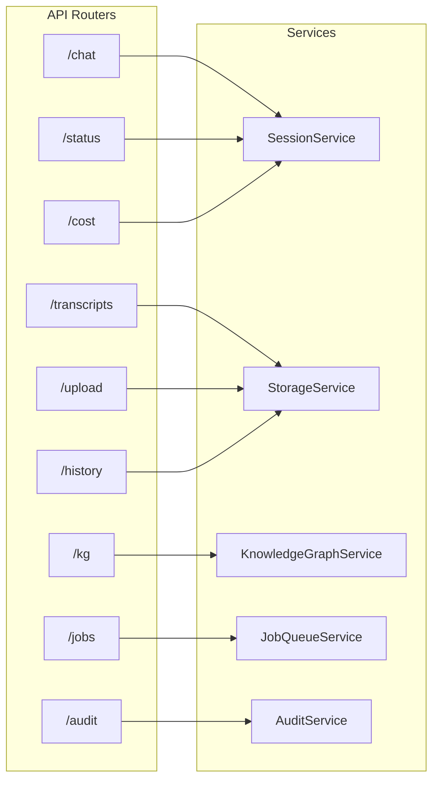

# API Reference

> Complete documentation for CognivAgent's REST API.

---

## What

CognivAgent exposes a REST API with **9 routers** covering:

- Chat and agent interaction
- Transcript management
- Knowledge graph operations
- Background job queue
- Audit trail access
- Cost tracking

---

## Why

### The Problem

AI applications need programmatic access for:
- Custom integrations
- Automation workflows
- Third-party tools

### The Solution

A comprehensive REST API with:

1. **Consistent responses** - Unified error schema
2. **Real-time updates** - SSE for activity streaming
3. **Full coverage** - All features accessible via API

---

## Base URL

```
http://localhost:8000
```

---

## Architecture Diagram



---

## Response Format

### Success

```json
{
  "data": { ... },
  "meta": {
    "cost": {
      "input_tokens": 1234,
      "output_tokens": 567,
      "total_cost_usd": 0.0234
    }
  }
}
```

### Error (Unified Schema)

```json
{
  "code": "ERROR_CODE",
  "message": "Human-readable message",
  "detail": "Technical details",
  "hint": "Suggestion for resolution",
  "retryable": false
}
```

### Error Codes

| Code | HTTP Status | Description |
|------|-------------|-------------|
| `VALIDATION_ERROR` | 400 | Invalid request data |
| `NOT_FOUND` | 404 | Resource not found |
| `SESSION_EXPIRED` | 410 | Session no longer exists |
| `RATE_LIMITED` | 429 | Too many requests |
| `INTERNAL_ERROR` | 500 | Server error |
| `SERVICE_UNAVAILABLE` | 503 | Temporary unavailability |

---

## Chat Endpoints

### Initialize Session

```http
POST /chat/init
```

**Request:**
```json
{
  "session_id": "uuid-v4-string"
}
```

**Response:**
```json
{
  "session_id": "abc123...",
  "status": "ready",
  "greeting": "Hello! I'm your AI assistant..."
}
```

---

### Send Message

```http
POST /chat/{session_id}
```

**Request:**
```json
{
  "message": "Transcribe this video"
}
```

**Response:**
```json
{
  "response": "I'll transcribe the video for you...",
  "cost": {
    "input_tokens": 500,
    "output_tokens": 200
  }
}
```

---

### Get Session Status

```http
GET /status/{session_id}
```

**Response:**
```json
{
  "status": "processing",
  "is_processing": true,
  "last_activity": "2024-01-15T10:30:00Z"
}
```

**Status Values:** `initializing`, `ready`, `processing`, `error`, `expired`

---

### Activity Stream (SSE)

```http
GET /chat/activity/{session_id}
```

**Response:** Server-Sent Events stream

```
event: thinking
data: {"type": "thinking"}

event: tool_use
data: {"type": "tool_use", "tool": "transcribe_video"}

event: completed
data: {"type": "completed"}
```

---

## Transcript Endpoints

### List Transcripts

```http
GET /transcripts
```

**Query Parameters:**
- `limit` (int, default: 50)
- `offset` (int, default: 0)

**Response:**
```json
{
  "transcripts": [
    {
      "id": "abc12345",
      "title": "Team Meeting",
      "duration_seconds": 2732,
      "word_count": 6847,
      "created_at": "2024-01-15T10:30:00Z"
    }
  ],
  "total": 42
}
```

---

### Get Transcript

```http
GET /transcripts/{id}
```

**Response:**
```json
{
  "id": "abc12345",
  "title": "Team Meeting",
  "text": "Full transcript text...",
  "metadata": {
    "duration_seconds": 2732,
    "language": "en",
    "source_file": "meeting.mp4"
  }
}
```

---

### Delete Transcript

```http
DELETE /transcripts/{id}
```

---

### Export Transcript

```http
GET /transcripts/{id}/export?format=txt
```

**Query Parameters:**
- `format`: `txt` | `json`

---

## Knowledge Graph Endpoints

### List Projects

```http
GET /kg/projects
```

**Response:**
```json
{
  "projects": [
    {
      "id": "proj123",
      "name": "AI Research",
      "state": "ACTIVE",
      "entity_count": 156,
      "relationship_count": 243
    }
  ]
}
```

---

### Create Project

```http
POST /kg/projects
```

**Request:**
```json
{
  "name": "AI Research"
}
```

---

### Get Project

```http
GET /kg/projects/{id}
```

---

### Delete Project

```http
DELETE /kg/projects/{id}
```

---

### Bootstrap Project

```http
POST /kg/projects/{id}/bootstrap
```

**Request:**
```json
{
  "transcript_id": "abc12345"
}
```

**Response:**
```json
{
  "domain_profile": {
    "thing_types": [
      {"name": "Person", "description": "Individuals"}
    ],
    "connection_types": [
      {"name": "works_for", "source": "Person", "target": "Organization"}
    ]
  },
  "discoveries_pending": true
}
```

---

### Confirm Discoveries

```http
POST /kg/projects/{id}/confirm
```

**Request:**
```json
{
  "confirmed_types": ["Person", "Organization"],
  "rejected_types": ["Event"]
}
```

---

### Extract Knowledge

```http
POST /kg/projects/{id}/extract
```

**Request:**
```json
{
  "transcript_id": "def67890"
}
```

---

### Get Graph Data (Cytoscape.js)

```http
GET /kg/projects/{id}/graph-data
```

**Response:**
```json
{
  "nodes": [
    {"data": {"id": "n1", "label": "Sam Altman", "type": "Person"}}
  ],
  "edges": [
    {"data": {"source": "n1", "target": "n2", "label": "founded"}}
  ]
}
```

---

### Export Graph

```http
GET /kg/projects/{id}/export?format=graphml
```

**Query Parameters:**
- `format`: `graphml` | `json`

---

### Get Duplicates

```http
GET /kg/projects/{id}/duplicates
```

---

### Merge Entities

```http
POST /kg/projects/{id}/merge
```

**Request:**
```json
{
  "source_id": "e2",
  "target_id": "e1"
}
```

---

## Job Queue Endpoints

### List Jobs

```http
GET /jobs
```

**Response:**
```json
{
  "jobs": [
    {
      "id": "job123",
      "type": "TRANSCRIPTION",
      "status": "RUNNING",
      "progress": 45
    }
  ]
}
```

---

### Get Job Status

```http
GET /jobs/{id}
```

**Response:**
```json
{
  "id": "job123",
  "type": "TRANSCRIPTION",
  "status": "RUNNING",
  "progress": 45,
  "stages": [
    {"name": "Upload", "status": "completed"},
    {"name": "Process", "status": "running"}
  ]
}
```

---

### Cancel Job

```http
POST /jobs/{id}/cancel
```

---

## Upload Endpoints

### Upload File

```http
POST /upload
Content-Type: multipart/form-data
```

**Form Fields:**
- `file`: Video/audio file (max 500 MB)
- `language` (optional): ISO 639-1 code
- `hints` (optional): Comma-separated terms

---

## Audit Endpoints

### Get Audit Logs

```http
GET /audit/logs
```

**Query Parameters:**
- `session_id` (optional)
- `tool` (optional)
- `limit` (int, default: 100)

---

### Get Audit Statistics

```http
GET /audit/stats
```

**Response:**
```json
{
  "total_tool_calls": 1234,
  "success_rate": 0.98,
  "blocked_operations": 5,
  "top_tools": [
    {"name": "transcribe_video", "count": 456}
  ]
}
```

---

## Cost Endpoints

### Get Session Cost

```http
GET /cost/{session_id}
```

**Response:**
```json
{
  "session_id": "sess123",
  "input_tokens": 45678,
  "output_tokens": 12345,
  "total_cost_usd": 1.23
}
```

---

## OpenAPI Documentation

Interactive API documentation available at:

- **Swagger UI**: `http://localhost:8000/docs`
- **ReDoc**: `http://localhost:8000/redoc`

---

## Related Guides

- [SDK Agent](sdk-agent.md) - Agent integration
- [Knowledge Graph](knowledge-graph.md) - KG endpoints in depth
- [Docker Deployment](docker-deployment.md) - API in production
