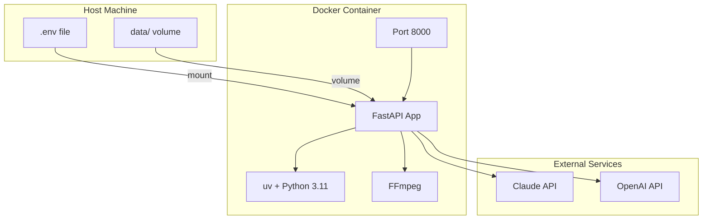

# Docker Deployment

> Container setup, health checks, and production deployment.

---

## What

CognivAgent can run in Docker containers for:

- **Consistent environments** - Same behavior everywhere
- **Easy deployment** - Single command to start
- **Isolation** - Separate from host system
- **Scalability** - Container orchestration ready

---

## Why

### The Problem

Python applications have complex dependencies (FFmpeg, system libraries) that vary across environments.

### The Solution

Docker packages everything into a reproducible image:

1. **Python 3.11** - Exact version pinned
2. **FFmpeg** - Audio/video processing
3. **uv** - Fast package management
4. **Non-root user** - Security best practice

### Design Decisions

| Decision | Rationale |
|----------|-----------|
| Python slim base | Smaller image (~400MB final) |
| uv over pip | Faster installs, better resolution |
| Non-root user | Security hardening |
| Volume mounts | Persist data across restarts |

---

## How

### Quick Start

```bash
# 1. Configure environment
cp .env.example .env
# Edit .env and add API keys

# 2. Run with Docker Compose
docker-compose up -d

# 3. Access application
open http://localhost:8000
```

---

## Architecture Diagram



---

## Key Files

| File | Purpose |
|------|---------|
| `Dockerfile` | Image definition |
| `docker-compose.yml` | Service orchestration |
| `.env.example` | Environment template |
| `.dockerignore` | Exclude from build context |

---

## Docker Compose

### docker-compose.yml

```yaml
version: '3.8'

services:
  app:
    build: .
    ports:
      - "8000:8000"
    environment:
      - ANTHROPIC_API_KEY=${ANTHROPIC_API_KEY}
      - OPENAI_API_KEY=${OPENAI_API_KEY}
    volumes:
      - ./data:/app/data
    restart: unless-stopped
    healthcheck:
      test: ["CMD", "curl", "-f", "http://localhost:8000/health"]
      interval: 30s
      timeout: 10s
      retries: 3
      start_period: 5s
```

### Commands

```bash
# Start services
docker-compose up -d

# View logs
docker-compose logs -f

# Stop services
docker-compose down

# Rebuild after changes
docker-compose up -d --build
```

---

## Dockerfile

```dockerfile
FROM python:3.11-slim

# Install system dependencies
RUN apt-get update && apt-get install -y \
    ffmpeg \
    curl \
    && rm -rf /var/lib/apt/lists/*

# Install uv
RUN pip install uv

# Create non-root user
RUN useradd -m -u 1000 agent
USER agent

# Set working directory
WORKDIR /app

# Copy dependency files
COPY --chown=agent:agent pyproject.toml uv.lock ./

# Install dependencies
RUN uv sync --frozen

# Copy application
COPY --chown=agent:agent . .

# Expose port
EXPOSE 8000

# Health check
HEALTHCHECK --interval=30s --timeout=10s --start-period=5s --retries=3 \
    CMD curl -f http://localhost:8000/health || exit 1

# Run application
CMD ["uv", "run", "python", "-m", "app.main", "--host", "0.0.0.0"]
```

---

## Environment Variables

### Required

```bash
ANTHROPIC_API_KEY=sk-ant-...    # Claude API
OPENAI_API_KEY=sk-...           # OpenAI API
```

### Optional (App Settings)

```bash
APP_CLAUDE_MODEL=claude-opus-4-5
APP_CLAUDE_API_MAX_CONCURRENT=2
APP_RESPONSE_TIMEOUT=300.0
APP_SESSION_TTL=3600.0
```

---

## Data Persistence

The `data/` directory is mounted as a volume:

```
data/
├── sessions/       # Chat sessions
├── transcripts/    # Saved transcripts
├── kg_projects/    # Knowledge graphs
├── exports/        # Graph exports
└── jobs/           # Job persistence
```

**Important**: Data persists across container restarts.

---

## Health Checks

### Endpoint

```bash
curl http://localhost:8000/health
# Response: {"status":"ok"}
```

### Docker Health Status

```bash
docker inspect --format='{{.State.Health.Status}}' agent-video-to-data
```

### States

| Status | Meaning |
|--------|---------|
| `starting` | Container booting, health check not run |
| `healthy` | Health check passing |
| `unhealthy` | Health check failing |

---

## Production Deployment

### Resource Limits

```yaml
services:
  app:
    deploy:
      resources:
        limits:
          cpus: '2'
          memory: 4G
        reservations:
          cpus: '1'
          memory: 2G
```

### Reverse Proxy (nginx)

```nginx
server {
    listen 443 ssl;
    server_name your-domain.com;

    ssl_certificate /path/to/cert.pem;
    ssl_certificate_key /path/to/key.pem;

    location / {
        proxy_pass http://localhost:8000;
        proxy_set_header Host $host;
        proxy_set_header X-Real-IP $remote_addr;
        proxy_set_header X-Forwarded-For $proxy_add_x_forwarded_for;
        proxy_set_header X-Forwarded-Proto $scheme;
    }

    # SSE support (important!)
    location /chat/activity/ {
        proxy_pass http://localhost:8000;
        proxy_http_version 1.1;
        proxy_set_header Connection '';
        proxy_buffering off;
        proxy_cache off;
    }
}
```

### HTTPS with Certbot

```bash
sudo apt install certbot python3-certbot-nginx
sudo certbot --nginx -d your-domain.com
```

---

## Troubleshooting

### Container Won't Start

```bash
# Check logs
docker-compose logs app

# Check container status
docker ps -a
```

### Health Check Failing

```bash
# Check if app is running
docker exec -it agent-video-to-data curl http://localhost:8000/health

# Check startup logs
docker logs agent-video-to-data --tail 50
```

### Permission Issues

```bash
# Fix data directory permissions
chmod -R 755 data/
chown -R 1000:1000 data/  # Match container user
```

### Missing Dependencies

```bash
# Rebuild without cache
docker-compose build --no-cache
```

---

## Security Considerations

### Non-Root User

Container runs as `agent` (UID 1000), not root.

### API Key Protection

- Never commit `.env` to version control
- Use Docker secrets in production
- Rotate keys regularly

### Network Isolation

```yaml
networks:
  internal:
    driver: bridge
    internal: true  # No external access
```

---

## Monitoring

### Log Aggregation

```bash
docker-compose logs -f --tail 100
```

### Prometheus Metrics (Future)

The `/health` endpoint can be extended for Prometheus scraping.

### Kubernetes Probes

```yaml
livenessProbe:
  httpGet:
    path: /health
    port: 8000
  initialDelaySeconds: 5
  periodSeconds: 30

readinessProbe:
  httpGet:
    path: /health
    port: 8000
  initialDelaySeconds: 5
  periodSeconds: 10
```

---

## Extension Points

### Custom Dockerfile

Override the base image or add dependencies:

```dockerfile
FROM agent-video-to-data:latest

# Add custom tools
RUN apt-get update && apt-get install -y your-package
```

### Environment Overrides

Add custom environment variables in docker-compose.yml:

```yaml
environment:
  - MY_CUSTOM_VAR=value
```

### Multi-Stage Build

For smaller production images, use multi-stage builds to exclude dev dependencies.

---

## Related Guides

- [API Reference](api-reference.md) - Endpoint documentation
- [Extending CognivAgent](extending-cognivagent.md) - Customization
- [SDK Agent](sdk-agent.md) - Agent configuration
