# Extending CognivAgent

> How to add MCP tools, API routers, frontend modules, and KG skills.

---

## What

CognivAgent is designed for extensibility:

- **MCP Tools** - Add new AI agent capabilities
- **API Routers** - Add new endpoints
- **Frontend Modules** - Add new UI features
- **KG Extraction Skills** - Customize knowledge extraction

---

## Why

### The Problem

Every research project has unique needs that generic tools don't address.

### The Solution

Clear extension points with:

1. **Consistent patterns** - Follow existing conventions
2. **Minimal coupling** - Changes isolated to specific areas
3. **Comprehensive tests** - Verify extensions work

---

## Extension Points Overview

```mermaid
%%{init: {'theme': 'base', 'themeVariables': { 'primaryColor': '#818cf8', 'primaryTextColor': '#1e1b4b', 'primaryBorderColor': '#6366f1', 'lineColor': '#94a3b8', 'secondaryColor': '#f8fafc', 'tertiaryColor': '#f1f5f9'}}}%%
graph TB
    subgraph Backend["⚙️ Backend Extensions"]
        TOOL[MCP Tools<br/>app/agent/tools.py]
        ROUTER[API Routers<br/>app/api/routers/]
        SERVICE[Services<br/>app/services/]
    end

    subgraph Frontend["🖥️ Frontend Extensions"]
        MODULE[ES Modules<br/>app/static/js/]
        TEMPLATE[Jinja2 Templates<br/>app/templates/]
    end

    subgraph Agent["🧠 Agent Extensions"]
        SKILL[Skills<br/>app/agent/resources/.claude/skills/]
        PROMPT[Prompts<br/>app/kg/prompts/]
    end

    TOOL --> SERVICE
    ROUTER --> SERVICE
    MODULE --> ROUTER
    SKILL --> TOOL

    classDef backend fill:#dcfce7,stroke:#22c55e,stroke-width:2px,color:#166534
    classDef frontend fill:#dbeafe,stroke:#3b82f6,stroke-width:2px,color:#1e40af
    classDef agent fill:#ffedd5,stroke:#f97316,stroke-width:2px,color:#9a3412

    class TOOL,ROUTER,SERVICE backend
    class MODULE,TEMPLATE frontend
    class SKILL,PROMPT agent
```



---

## Adding an MCP Tool

MCP tools give the AI agent new capabilities using the `@tool` decorator.

### Step 1: Define the Tool

```python
# app/agent/tools.py

from claude_agent_sdk import tool
from typing import Any

@tool(
    "my_custom_tool",                    # Tool name (unique identifier)
    "Description for Claude to see",     # What this tool does
    {"param": str, "optional_flag": bool} # Input schema
)
async def my_custom_tool(args: dict[str, Any]) -> dict[str, Any]:
    """Tool implementation."""
    try:
        # Your implementation
        result = await do_something(args.get("param"))

        # ✅ Success response
        return {
            "content": [
                {"type": "text", "text": f"Result: {result}"}
            ]
        }
    except Exception as e:
        # ✅ Error response (NEVER raise!)
        return {
            "content": [
                {"type": "text", "text": f"Error: {str(e)}"}
            ]
        }
```

**CRITICAL**: Never raise exceptions from tools - they crash the agent loop.

### Step 2: Create MCP Server

```python
# app/agent/server.py

from claude_agent_sdk import create_sdk_mcp_server
from .tools import my_custom_tool, another_tool

# Create MCP server with your tools
custom_tools_server = create_sdk_mcp_server(
    name="custom-tools",
    version="1.0.0",
    tools=[my_custom_tool, another_tool]
)
```

### Step 3: Register with Agent

```python
# app/core/session.py (in SessionActor)

from claude_agent_sdk import ClaudeAgentOptions

options = ClaudeAgentOptions(
    mcp_servers={"custom": custom_tools_server},
    allowed_tools=["mcp__custom__my_custom_tool", "mcp__custom__another_tool"]
)
```

### Step 4: Add to Allowlist

```json
// app/agent/resources/.claude/settings.json
{
  "allowed_tools": [
    "mcp__custom__my_custom_tool"
  ]
}
```

### Step 5: Document for Agent

Add to `app/agent/resources/CLAUDE.md`:

```markdown
### my_custom_tool

Description of what this tool does and when to use it.

**Parameters:**
- `param` (string): Description

**Example:**
```json
{"param": "value"}
```
```

### Step 6: Write Tests

```python
# tests/test_my_tool.py

import pytest
from app.agent.tools import my_custom_tool

class TestMyCustomTool:
    @pytest.mark.asyncio
    async def test_success(self):
        result = await my_custom_tool({"param": "test"})
        assert "content" in result

    @pytest.mark.asyncio
    async def test_error_handling(self):
        result = await my_custom_tool({})
        assert result.get("success") is False
```

---

## Adding an API Router

### Step 1: Create the Router

```python
# app/api/routers/my_feature.py

from fastapi import APIRouter, Depends, HTTPException
from pydantic import BaseModel

from app.api.deps import get_session_service
from app.services import SessionService

router = APIRouter(prefix="/my-feature", tags=["my-feature"])


class MyRequest(BaseModel):
    param: str


class MyResponse(BaseModel):
    result: str


@router.post("", response_model=MyResponse)
async def create_something(
    request: MyRequest,
    service: SessionService = Depends(get_session_service),
) -> MyResponse:
    """Create something new."""
    result = await service.do_something(request.param)
    return MyResponse(result=result)


@router.get("/{item_id}")
async def get_something(item_id: str) -> dict:
    """Get something by ID."""
    # Implementation
    return {"id": item_id}
```

### Step 2: Register the Router

```python
# app/main.py

from app.api.routers import my_feature

app.include_router(my_feature.router)
```

### Step 3: Add Dependency (if needed)

```python
# app/api/deps.py

def get_my_service() -> MyService:
    return get_services().my_service
```

### Step 4: Write Tests

```python
# tests/test_my_feature_api.py

import pytest
from httpx import AsyncClient, ASGITransport
from app.main import app


@pytest.mark.asyncio
async def test_create_something():
    async with AsyncClient(
        transport=ASGITransport(app=app),
        base_url="http://test"
    ) as client:
        response = await client.post(
            "/my-feature",
            json={"param": "test"}
        )
        assert response.status_code == 200
```

---

## Adding a Frontend Module

### Step 1: Create the Module

```javascript
// app/static/js/my-feature/my-module.js

import { state } from '../core/state.js';
import { showToast } from '../ui/toast.js';

/**
 * Initialize the feature
 */
export function initMyFeature() {
    console.log('My feature initialized');
}

/**
 * Main functionality
 * @param {string} param - Description
 * @returns {Promise<object>} Result
 */
export async function doSomething(param) {
    try {
        const response = await fetch('/my-feature', {
            method: 'POST',
            headers: { 'Content-Type': 'application/json' },
            body: JSON.stringify({ param })
        });

        if (!response.ok) {
            throw new Error('Request failed');
        }

        return await response.json();
    } catch (error) {
        showToast(`Error: ${error.message}`, 'error');
        throw error;
    }
}

// Export for onclick handlers if needed
window.doSomething = doSomething;
```

### Step 2: Import in main.js

```javascript
// app/static/js/main.js

import { initMyFeature } from './my-feature/my-module.js';

document.addEventListener('DOMContentLoaded', () => {
    // ... existing init ...

    // Initialize your feature
    initMyFeature();
});
```

### Step 3: Add UI (if needed)

```html
<!-- app/templates/index.html -->

<div id="my-feature-panel">
    <button onclick="doSomething('test')">
        Do Something
    </button>
</div>
```

---

## Adding a KG Extraction Skill

Skills are reusable workflow patterns for the agent.

### Step 1: Create Skill Directory

```
app/agent/resources/.claude/skills/my-extraction/
└── SKILL.md
```

### Step 2: Write the Skill

```markdown
<!-- app/agent/resources/.claude/skills/my-extraction/SKILL.md -->

# My Extraction Skill

## When to Use

Use this skill when the user asks to extract [specific type of information].

## Workflow

1. Check if a KG project exists or needs creation
2. Verify the transcript is available
3. Extract using the domain profile
4. Present findings to user

## Extraction Prompt

When extracting [type], focus on:
- [Specific entity type 1]
- [Specific entity type 2]
- [Relationship pattern]

## Example

User: "Extract all the funding information from this transcript"

Response:
1. Identify funding rounds, amounts, investors
2. Create relationships: Investor → invested_in → Company
3. Note source citations
```

---

## Adding Custom Entity Types

### Modify Bootstrap Prompt

```python
# app/kg/prompts/bootstrap.py

BOOTSTRAP_PROMPT = """
Analyze this transcript and identify:

- Entity types to extract (e.g., Person, Organization, {custom_type})
- Relationship types to track
- Key entities for naming consistency

{additional_instructions}
"""
```

### Add Type Colors (Frontend)

```javascript
// app/static/js/kg/graph.js

const TYPE_COLORS = {
    'Person': '#3b82f6',
    'Organization': '#10b981',
    'MyCustomType': '#ff6b6b',  // Add your type
    // ...
};
```

---

## Adding Export Formats

### Extend Persistence

```python
# app/kg/persistence.py

def to_custom_format(kb: KnowledgeBase) -> str:
    """Export to custom format."""
    data = {
        "nodes": [node.model_dump() for node in kb.nodes],
        "edges": [edge.model_dump() for edge in kb.edges],
    }
    return your_serialization(data)
```

### Add API Endpoint

```python
# app/api/routers/kg.py

@router.get("/projects/{id}/export")
async def export_graph(
    id: str,
    format: str = Query(default="graphml"),
):
    if format == "custom":
        data = to_custom_format(kb)
        return Response(
            content=data,
            media_type="application/x-custom"
        )
```

---

## Testing Extensions

### Run Tests

```bash
# All tests
uv run pytest

# Specific test file
uv run pytest tests/test_my_feature.py

# With coverage
uv run pytest --cov=app --cov-report=html
```

### Type Check

```bash
uv run mypy app/
```

### Lint

```bash
uv run ruff check app/
uv run ruff format app/
```

---

## Best Practices

### Follow Existing Patterns

Look at similar code in the codebase and follow the same style.

### Write Tests First

Test-driven development catches issues early.

### Document Your Changes

- Update relevant guides
- Add docstrings to functions
- Update CLAUDE.md if adding tools

### Keep Changes Focused

One feature per PR. Don't mix unrelated changes.

### Handle Errors Gracefully

- Never let exceptions escape MCP tools
- Return structured error responses
- Log errors for debugging

---

## Related Guides

- [SDK Agent](sdk-agent.md) - MCP tool integration
- [Knowledge Graph](knowledge-graph.md) - KG architecture
- [Frontend Architecture](frontend-architecture.md) - Module organization
- [API Reference](api-reference.md) - Endpoint patterns
