# Frontend Architecture

> ES Modules-based vanilla JavaScript frontend with Tailwind CSS.

---

## What

CognivAgent's frontend consists of **37 ES modules** organized by feature:

- **Chat system** - Message rendering, activity streaming, session management
- **Knowledge Graph** - Cytoscape.js visualization, search, entity inspector
- **Jobs** - Background task progress tracking
- **Panels** - History, transcripts, audit trail
- **UI** - Theme, toast notifications, responsive layout

---

## Why

### The Problem

Modern AI applications need rich, interactive UIs without the complexity of build pipelines or heavy frameworks.

### The Solution

A **zero-build vanilla JavaScript** architecture:

1. **ES Modules** - Native browser module system
2. **Tailwind CSS via CDN** - No build step required
3. **Jinja2 templates** - Server-rendered HTML shells
4. **CDN libraries** - Marked.js, DOMPurify, Cytoscape.js

### Design Decisions

| Decision | Rationale |
|----------|-----------|
| No bundler | Simplicity, fast iteration, easy debugging |
| ES Modules | Modern browsers support natively |
| CDN dependencies | No npm/node required for frontend |
| Centralized state | Single source of truth in `state.js` |

---

## How

### Module Organization

```
app/static/js/
├── main.js              # Entry point - aggregates all modules
├── core/                # Shared state and utilities
│   ├── config.js        # App configuration, poll intervals
│   ├── state.js         # Centralized state object
│   └── utils.js         # Helper functions
├── ui/                  # UI components
│   ├── theme.js         # Dark/light theme toggle
│   ├── toast.js         # Toast notifications
│   ├── sidebar.js       # Sidebar collapse/expand
│   ├── header.js        # Header dropdowns
│   ├── mobile.js        # Mobile navigation
│   └── workspace.js     # 3-panel resizable layout
├── chat/                # Chat system
│   ├── messages.js      # Message rendering with markdown
│   ├── send.js          # Message sending with retry
│   ├── session.js       # Session init and restoration
│   ├── status.js        # Agent status polling
│   └── activity.js      # Real-time activity streaming (SSE)
├── panels/              # Sidebar panels
│   ├── history.js       # Session history
│   ├── transcripts.js   # Transcript library
│   ├── transcript-search.js
│   └── transcript-viewer.js
├── jobs/                # Background jobs
│   ├── jobs.js          # Job progress UI
│   └── step-progress.js # Step indicators
├── upload/              # File uploads
│   └── upload.js        # Video upload handling
├── audit/               # Audit trail
│   ├── index.js         # Module aggregator
│   ├── api.js           # Audit API client
│   └── panel.js         # Audit panel UI
└── kg/                  # Knowledge Graph (12 modules)
    ├── index.js         # Module aggregator
    ├── api.js           # KG API client
    ├── panel.js         # Panel management
    ├── graph.js         # Cytoscape.js integration
    ├── search.js        # Graph search
    ├── inspector.js     # Node inspector
    ├── evidence.js      # Citation viewer
    ├── suggestions.js   # Interactive insights
    └── merge-modal.js   # Entity merge UI
```

---

## Architecture Diagram

```mermaid
%%{init: {'theme': 'base', 'themeVariables': { 'primaryColor': '#818cf8', 'primaryTextColor': '#1e1b4b', 'primaryBorderColor': '#6366f1', 'lineColor': '#94a3b8', 'secondaryColor': '#f8fafc', 'tertiaryColor': '#f1f5f9'}}}%%
graph TB
    subgraph Entry["📦 Entry Point"]
        MAIN[main.js]
    end

    subgraph Core["⚙️ Core"]
        STATE[state.js]
        CONFIG[config.js]
        UTILS[utils.js]
    end

    subgraph Chat["💬 Chat"]
        MSG[messages.js]
        SEND[send.js]
        SESS[session.js]
        STATUS[status.js]
        ACT[activity.js]
    end

    subgraph UI["🎨 UI"]
        THEME[theme.js]
        TOAST[toast.js]
        SIDEBAR[sidebar.js]
        WORK[workspace.js]
    end

    subgraph Panels["📋 Panels"]
        HIST[history.js]
        TRANS[transcripts.js]
        AUDIT_P[audit/panel.js]
    end

    subgraph KG["🕸️ Knowledge Graph"]
        KG_API[kg/api.js]
        KG_GRAPH[kg/graph.js]
        KG_SEARCH[kg/search.js]
        KG_INSP[kg/inspector.js]
    end

    subgraph CDN["🌐 External CDN"]
        MARKED[Marked.js]
        PURIFY[DOMPurify]
        CYTO[Cytoscape.js]
    end

    MAIN --> STATE
    MAIN --> CONFIG
    MAIN --> THEME
    MAIN --> SESS

    MSG --> PURIFY
    MSG --> MARKED
    SEND --> ACT
    SEND --> MSG

    KG_GRAPH --> CYTO
    KG_GRAPH --> STATE

    MSG --> TOAST
    SEND --> TOAST

    classDef entry fill:#f1f5f9,stroke:#64748b,stroke-width:2px,color:#334155
    classDef core fill:#f3e8ff,stroke:#a855f7,stroke-width:2px,color:#6b21a8
    classDef chat fill:#dbeafe,stroke:#3b82f6,stroke-width:2px,color:#1e40af
    classDef ui fill:#dcfce7,stroke:#22c55e,stroke-width:2px,color:#166534
    classDef panels fill:#fce7f3,stroke:#ec4899,stroke-width:2px,color:#9d174d
    classDef kg fill:#e0e7ff,stroke:#6366f1,stroke-width:2px,color:#3730a3
    classDef cdn fill:#fee2e2,stroke:#ef4444,stroke-width:2px,color:#991b1b

    class MAIN entry
    class STATE,CONFIG,UTILS core
    class MSG,SEND,SESS,STATUS,ACT chat
    class THEME,TOAST,SIDEBAR,WORK ui
    class HIST,TRANS,AUDIT_P panels
    class KG_API,KG_GRAPH,KG_SEARCH,KG_INSP kg
    class MARKED,PURIFY,CYTO cdn
```



---

## Key Files

| File | Purpose |
|------|---------|
| `main.js` | Entry point, initialization sequence |
| `core/state.js` | Centralized state object |
| `core/config.js` | Configuration with server-injected values |
| `chat/messages.js` | Message rendering with XSS protection |
| `chat/activity.js` | SSE streaming for real-time feedback |
| `kg/graph.js` | Cytoscape.js visualization |
| `ui/workspace.js` | 3-panel resizable layout |

---

## State Management

Centralized state in `core/state.js`:

```javascript
export const state = {
    // Session
    sessionId: null,           // UUID v4 from sessionStorage
    isProcessing: false,       // Chat processing state

    // Knowledge Graph
    kgCurrentProjectId: null,  // Selected KG project
    cytoscapeInstance: null,   // Cytoscape.js graph

    // DOM References
    messagesContainer: null,
    messageInput: null,
    // ... more element refs
};

export function initDOMReferences();  // Called on DOMContentLoaded
export function resetKGState();       // Clear KG state
```

---

## Chat System

### Message Rendering

```javascript
// chat/messages.js
export function addMessage(text, sender, usage);
export function showLoading();           // Returns loadingId
export function removeLoading(id);
export function updateLoadingActivity(text);  // Real-time feedback
```

**Security**: All agent messages sanitized via DOMPurify before rendering.

### Activity Streaming

Real-time agent activity via Server-Sent Events:

```javascript
// chat/activity.js
export function startActivityStream(callback);  // Opens SSE
export function stopActivityStream();           // Closes connection
```

**Activity Types**: `thinking`, `tool_use`, `tool_result`, `subagent`, `completed`

**Debouncing**: Rapid tool sequences debounced at 150ms to prevent UI flicker.

---

## Knowledge Graph Visualization

### Cytoscape.js Integration

```javascript
// kg/graph.js
export function initKGGraph(container, graphData);
export function changeGraphLayout(layoutName);
export function fitGraphView();
```

**Layouts**: `cose` (force-directed), `grid`, `circle`, `breadthfirst`

### Entity Type Colors

| Type | Color |
|------|-------|
| Person | Blue (#3b82f6) |
| Organization | Green (#10b981) |
| Event | Amber (#f59e0b) |
| Location | Red (#ef4444) |
| Concept | Purple (#8b5cf6) |
| Technology | Cyan (#06b6d4) |

---

## Jobs Module

### Auto-Continuation Pattern

When background jobs complete, the frontend sends a hidden message to the agent:

```javascript
// jobs/jobs.js
export function triggerJobCompletionCallback(job);
```

**Race Condition Handling**: `sendMessageWhenReady()` retries at 500ms intervals until `state.isProcessing` clears.

---

## Security Patterns

### XSS Protection

```javascript
// Always sanitize agent content
const clean = DOMPurify.sanitize(agentMessage, PURIFY_CONFIG);

// Escape user-controlled text
const safe = escapeHtml(userInput);
```

### Session Isolation

- Session ID in `sessionStorage` (tab-scoped)
- UUID v4 generated client-side

---

## Initialization Flow

```javascript
// main.js - DOMContentLoaded
document.addEventListener('DOMContentLoaded', () => {
    // 1. Reset state
    resetKGState();

    // 2. Init DOM references
    initDOMReferences();

    // 3. Init UI
    initTheme();
    initToastContainer();
    initSidebarCollapse();

    // 4. Init features
    initFileUpload();
    initGraphSearch();

    // 5. Load data
    loadHistory();
    loadTranscripts();
    loadKGProjects();
    loadJobs();

    // 6. Start polling
    startStatusPolling();

    // 7. Init session
    initSession();
});
```

---

## Keyboard Shortcuts

| Shortcut | Action |
|----------|--------|
| `Ctrl+Enter` / `Cmd+Enter` | Send chat message |
| `Escape` | Close modals/inspectors |

---

## Common Pitfalls

### DOM Selector Mistakes

```javascript
// ✅ CORRECT: Use getElementById
state.kgCaret = document.getElementById('kg-caret');

// ❌ WRONG: Typos fail silently
state.kgCaret = document.querySelector('#kg-toggle .sidebar-caret');
```

Wrong selectors return `null` without errors, causing UI to appear broken.

### Hidden Elements

When debugging "can't click element" issues:
1. Check parent visibility (`max-height: 0`, `opacity: 0`)
2. Elements exist in DOM but may be invisible
3. Verify toggle/expand mechanism works

---

## Extension Points

### Add New Module

1. Create file in appropriate directory
2. Export functions needed by other modules
3. Import in `main.js` or relevant aggregator
4. Add to initialization flow if needed

### Add Window Export

For inline `onclick` handlers:

```javascript
// At module end
window.myGlobalFunction = myFunction;
```

### Add Keyboard Shortcut

Extend `initKeyboardShortcuts()` in `main.js`.

---

## Related Guides

- [SDK Agent](sdk-agent.md) - Activity streaming integration
- [API Reference](api-reference.md) - Frontend API calls
- [Extending CognivAgent](extending-cognivagent.md) - Add custom modules
