# Knowledge Graph

> Transform unstructured video content into queryable knowledge graphs.

---

## What

The Knowledge Graph (KG) system automatically:

- **Infers domain schemas** from your first video
- **Extracts entities** (people, organizations, concepts, events)
- **Identifies relationships** between entities
- **Resolves duplicates** using similarity matching
- **Exports graphs** for analysis in external tools (Gephi, Neo4j, yEd)

---

## Why

### The Problem

Video content contains rich, interconnected information that's difficult to search, analyze, or connect across sources. Traditional transcription produces flat text that loses the relationships between concepts.

### The Solution

CognivAgent builds a knowledge graph that:

1. **Captures structure** - Entities and relationships, not just text
2. **Enables queries** - "Who founded what company?" becomes answerable
3. **Connects sources** - Same entities across multiple videos are linked
4. **Adapts to domains** - Auto-infers schema from your specific content

### Design Decisions

| Decision | Rationale |
|----------|-----------|
| Bootstrap from first video | Let the content define the schema, not predefined templates |
| Confirm before extract | Human-in-the-loop ensures quality domain profiles |
| NetworkX storage | Simple, Pythonic, no external database required |
| GraphML export | Universal format for graph analysis tools |

---

## How

### Workflow

```mermaid
%%{init: {'theme': 'base', 'themeVariables': { 'primaryColor': '#818cf8', 'primaryTextColor': '#1e1b4b', 'primaryBorderColor': '#6366f1', 'lineColor': '#94a3b8', 'secondaryColor': '#f8fafc', 'tertiaryColor': '#f1f5f9'}}}%%
graph LR
    A[📁 Create Project] --> B[🔍 Bootstrap]
    B --> C[✓ Confirm Discoveries]
    C --> D[⚡ Extract]
    D --> E[🔗 Resolve Duplicates]
    E --> F[📤 Export]
    D --> D

    classDef step fill:#e0e7ff,stroke:#6366f1,stroke-width:2px,color:#3730a3

    class A,B,C,D,E,F step
```



### Step 1: Create Project

```
You: Create a knowledge graph project called "AI Startup Research"

Agent: Created project "AI Startup Research" (ID: abc123)
```

**State: CREATED**

### Step 2: Bootstrap

First transcript triggers domain inference. Claude analyzes the content and suggests:

- **Entity types** (Person, Company, Technology, etc.)
- **Relationship types** (founded, works_for, uses, etc.)
- **Seed entities** for naming consistency

```
You: Bootstrap the project with transcript xyz789

Agent: Discovered Entity Types:
       ✓ Person (founders, investors)
       ✓ Company (startups, corporations)
       ✓ Technology (AI models, frameworks)
```

**State: BOOTSTRAPPING → ACTIVE**

### Step 3: Confirm Discoveries

Review and approve/reject discovered types before extraction begins.

### Step 4: Extract

Subsequent transcripts use the confirmed schema for consistent extraction.

```
You: Extract knowledge from transcript def456

Agent: Found 12 entities, 8 relationships
```

**State: ACTIVE**

### Step 5: Resolve Duplicates

Multi-signal similarity matching detects potential duplicates:

| Signal | Weight | Description |
|--------|--------|-------------|
| Jaro-Winkler | 40% | Edit distance for names |
| Alias Overlap | 30% | Shared alternative names |
| Type Match | 20% | Same entity type bonus |
| Context | 10% | Co-occurrence patterns |

### Step 6: Export

Download as GraphML (for Gephi, Neo4j, yEd) or JSON.

---

## Architecture Diagram

```mermaid
%%{init: {'theme': 'base', 'themeVariables': { 'primaryColor': '#818cf8', 'primaryTextColor': '#1e1b4b', 'primaryBorderColor': '#6366f1', 'lineColor': '#94a3b8', 'secondaryColor': '#f8fafc', 'tertiaryColor': '#f1f5f9'}}}%%
graph TB
    subgraph API["⚡ API Layer"]
        KG_API["/kg/* Endpoints"]
    end

    subgraph Service["🔧 Service Layer"]
        KGS[KnowledgeGraphService]
        CLAUDE[Claude API]
    end

    subgraph Domain["🧠 Domain Layer"]
        DP[DomainProfile]
        KB[KnowledgeBase]
        RES[EntityResolver]
    end

    subgraph Storage["💾 Storage"]
        JSON[(JSON Files)]
        GRAPHML[(GraphML Export)]
    end

    KG_API --> KGS
    KGS --> CLAUDE
    KGS --> DP
    KGS --> KB
    KGS --> RES
    KB --> JSON
    KB --> GRAPHML

    classDef api fill:#dcfce7,stroke:#22c55e,stroke-width:2px,color:#166534
    classDef service fill:#f3e8ff,stroke:#a855f7,stroke-width:2px,color:#6b21a8
    classDef domain fill:#ffedd5,stroke:#f97316,stroke-width:2px,color:#9a3412
    classDef storage fill:#e0e7ff,stroke:#6366f1,stroke-width:2px,color:#3730a3

    class KG_API api
    class KGS,CLAUDE service
    class DP,KB,RES domain
    class JSON,GRAPHML storage
```



---

## Key Files

| File | Purpose |
|------|---------|
| `app/kg/domain.py` | DomainProfile, ThingType, ProjectState models |
| `app/kg/models.py` | Node, Edge, Source graph models |
| `app/kg/knowledge_base.py` | NetworkX graph wrapper with queries |
| `app/kg/resolution.py` | Entity deduplication and merge logic |
| `app/kg/persistence.py` | JSON/GraphML serialization |
| `app/services/kg_service.py` | Orchestrates bootstrap/extract workflows |
| `app/kg/tools/` | MCP tools for agent integration |

---

## Domain Models

### DomainProfile

Inferred schema from first video:

```python
DomainProfile(
    thing_types=[
        ThingType(name="Person", description="Individuals"),
        ThingType(name="Company", description="Organizations"),
    ],
    connection_types=[
        ConnectionType(name="founded", source="Person", target="Company"),
    ],
    seed_entities=[
        SeedEntity(name="Sam Altman", type="Person"),
    ]
)
```

### Project States

```
CREATED → BOOTSTRAPPING → ACTIVE → STABLE
```

- **CREATED**: Empty project, awaiting first transcript
- **BOOTSTRAPPING**: Claude analyzing first transcript
- **ACTIVE**: Extracting from transcripts
- **STABLE**: Schema locked, ready for production

---

## API Endpoints

| Endpoint | Method | Description |
|----------|--------|-------------|
| `/kg/projects` | GET | List all projects |
| `/kg/projects` | POST | Create new project |
| `/kg/projects/{id}` | GET | Get project details |
| `/kg/projects/{id}/bootstrap` | POST | Bootstrap with transcript |
| `/kg/projects/{id}/confirm` | POST | Confirm discoveries |
| `/kg/projects/{id}/extract` | POST | Extract from transcript |
| `/kg/projects/{id}/graph-data` | GET | Cytoscape.js format |
| `/kg/projects/{id}/export` | GET | GraphML/JSON export |
| `/kg/projects/{id}/duplicates` | GET | List potential duplicates |
| `/kg/projects/{id}/merge` | POST | Merge entities |

---

## Graph Visualization

The frontend uses Cytoscape.js with:

- **Force-directed layout** (cose algorithm)
- **Node colors by type** (Person=blue, Organization=green, etc.)
- **Search highlighting** with dimming of non-matches
- **Node inspector panel** with entity details
- **Evidence viewer** showing source citations

### Entity Type Colors

| Type | Color |
|------|-------|
| Person, Character | Blue (#3b82f6) |
| Organization, Group | Green (#10b981) |
| Event | Amber (#f59e0b) |
| Location | Red (#ef4444) |
| Concept, Theme | Purple (#8b5cf6) |
| Technology | Cyan (#06b6d4) |

---

## Extension Points

### Add Custom Entity Types

Modify the bootstrap prompt in `app/kg/prompts/bootstrap.py` to suggest domain-specific types.

### Add Extraction Rules

Enhance `app/kg/prompts/extraction.py` to include custom extraction patterns.

### Add Export Formats

Extend `app/kg/persistence.py` with new serialization formats (RDF, CSV, etc.).

### Add Similarity Signals

Extend `app/kg/resolution.py` to include additional matching signals (embeddings, co-references).

---

## Related Guides

- [SDK Agent](sdk-agent.md) - How Claude extracts knowledge
- [API Reference](api-reference.md) - Full KG endpoint documentation
- [Extending CognivAgent](extending-cognivagent.md) - Add custom KG features
