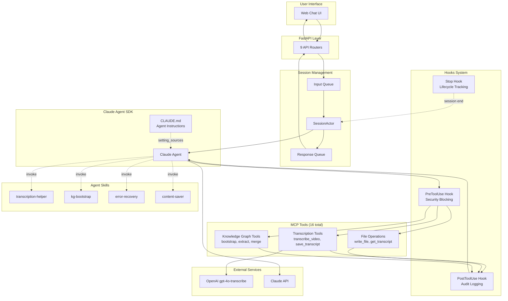

# Claude Agent SDK Integration

> How CognivAgent uses the Claude Agent SDK for AI-powered video analysis.

---

## What

CognivAgent integrates the **Claude Agent SDK** to provide:

- **Conversational AI** with multi-turn context
- **MCP Tools** for transcription, file operations, and knowledge graph management
- **Hooks System** for security blocking and audit logging
- **Skills** for reusable agent workflows
- **Session Management** with queue-based actor pattern

---

## Why

### The Problem

Building AI-powered applications requires:
- Managing agent state across requests
- Implementing tool calling with proper error handling
- Ensuring security (blocking dangerous operations)
- Logging tool usage for audit trails
- Handling concurrent requests safely

### The Solution

CognivAgent wraps the Claude Agent SDK with:

1. **SessionActor** - Queue-based pattern for thread-safe concurrent access
2. **AuditHookFactory** - Pre/post hooks for security and logging
3. **MCP Tools** - 16 custom tools for video analysis workflows
4. **Skills** - Reusable workflow patterns the agent can invoke

### Design Decisions

| Decision | Rationale |
|----------|-----------|
| Queue-based SessionActor | Claude SDK uses asyncio cancel scopes that break with direct concurrent access |
| PreToolUse hooks | Block dangerous bash commands before execution |
| PostToolUse hooks | Audit trail of all tool invocations |
| setting_sources=["project"] | Load CLAUDE.md agent instructions automatically |

---

## How

### Architecture Diagram



**Diagram explains:**
- Request flow: UI → API → Queue → SessionActor → Agent
- Tool execution with pre/post hooks for security and auditing
- Skills integration for reusable workflows
- External service connections (OpenAI, Claude API)
- Response flow back to user

---

## SessionActor Pattern

The SessionActor serializes all requests through queues to prevent Claude SDK cancel scope errors:

```
HTTP Request → input_queue → [SessionActor] → response_queue → Response
```

### Why Queues?

The Claude SDK uses Python's `asyncio` with cancel scopes. Direct concurrent access from multiple HTTP requests causes race conditions. The SessionActor pattern ensures:

1. **Thread Safety** - All SDK calls serialized through single actor
2. **Request Isolation** - Each request gets its response via queue
3. **Clean Lifecycle** - Actor manages SDK client lifecycle

### Implementation

```python
# app/core/session.py (simplified)
class SessionActor:
    def __init__(self):
        self.input_queue = asyncio.Queue()
        self.response_queue = asyncio.Queue()

    async def run(self):
        options = ClaudeAgentOptions(
            cwd=Path("app/agent/resources"),
            setting_sources=["project"],  # Load CLAUDE.md
            hooks=create_audit_hooks(session_id, audit_service),
            mcp_servers={"video-tools": video_mcp_server}
        )

        async with ClaudeSDKClient(options) as client:
            while True:
                request = await self.input_queue.get()
                await client.query(request.message)
                async for message in client.receive_response():
                    await self.response_queue.put(message)
```

---

## Hooks System

### Hook Events

| Event | Trigger | Purpose |
|-------|---------|---------|
| `PreToolUse` | Before tool execution | Block dangerous commands |
| `PostToolUse` | After tool execution | Audit logging |
| `Stop` | Agent stops | Lifecycle tracking |
| `SubagentStop` | Subagent completes | Track delegated work |

### Security Blocking (PreToolUse)

The `AuditHookFactory` blocks dangerous operations before they execute:

**Protected Paths:**
- `/etc/`, `/usr/`, `/bin/`, `/sbin/`
- `/boot/`, `/dev/`, `/proc/`, `/sys/`
- `/var/log/`, `/root/`

**Blocked Patterns:**
- `rm -rf /` - Destructive deletion
- `dd if=` - Raw disk writes
- Fork bombs - `:(){:|:&};:`
- `chmod -R 777 /` - Dangerous permissions

### Audit Logging (PostToolUse)

Every tool invocation is logged with:
- Tool name and inputs
- Execution duration
- Success/failure status
- Truncated output (prevents log bloat)

### Hook Implementation

```python
# app/core/hooks.py
from claude_agent_sdk import HookMatcher

def create_audit_hooks(session_id: str, audit_service: AuditService):
    return {
        'PreToolUse': [
            HookMatcher(hooks=[log_tool_intent]),
            HookMatcher(matcher='Bash', hooks=[block_dangerous_commands])
        ],
        'PostToolUse': [
            HookMatcher(hooks=[log_tool_result])
        ],
        'Stop': [
            HookMatcher(hooks=[log_session_end])
        ]
    }
```

---

## MCP Tools

CognivAgent provides 16 MCP tools organized by function:

### Transcription Tools

| Tool | Description |
|------|-------------|
| `transcribe_video` | Video/audio → text via gpt-4o-transcribe |
| `save_transcript` | Persist with unique 8-char ID |
| `get_transcript` | Retrieve by ID |
| `list_transcripts` | List all saved transcripts |

### File Operations

| Tool | Description |
|------|-------------|
| `write_file` | Save content with path validation |

### Knowledge Graph Tools

| Tool | Description |
|------|-------------|
| `create_kg_project` | Create new KG project |
| `bootstrap_kg_project` | Infer domain from first transcript |
| `extract_to_kg` | Extract entities/relationships |
| `list_kg_projects` | List projects with stats |
| `get_kg_stats` | Get graph statistics |
| `find_duplicates` | Detect duplicate entities |
| `merge_entities` | Merge duplicate entities |

### Tool Naming Convention

MCP tools follow this pattern:
```
mcp__{server_name}__{tool_name}
```

Example: `mcp__video-tools__transcribe_video`

---

## Agent Skills

Skills are reusable workflow patterns located in `app/agent/resources/.claude/skills/`:

| Skill | Purpose |
|-------|---------|
| `transcription-helper` | Guide video transcription workflow |
| `kg-bootstrap` | Bootstrap knowledge graph from first video |
| `error-recovery` | Handle and recover from tool errors |
| `content-saver` | Save content with proper formatting |

Skills are invoked by the agent when it recognizes a matching workflow pattern.

---

## System Prompts

### CLAUDE.md Loading

The SDK loads agent instructions from `app/agent/resources/CLAUDE.md` via `setting_sources`:

```python
options = ClaudeAgentOptions(
    cwd=Path("app/agent/resources"),
    setting_sources=["project"]  # Required to load CLAUDE.md!
)
```

### Agent Instructions

The CLAUDE.md file contains:
- Available MCP tools and their usage
- Workflow patterns for transcription and KG
- Error handling guidelines
- Response formatting rules

---

## Key Files

| File | Purpose |
|------|---------|
| `app/core/session.py` | SessionActor wrapping Claude SDK |
| `app/services/session.py` | SessionService API |
| `app/core/hooks.py` | AuditHookFactory with HookMatcher |
| `app/agent/server.py` | MCP server with tools |
| `app/agent/tools.py` | Tool implementations |
| `app/agent/resources/CLAUDE.md` | Agent instructions |
| `app/agent/resources/.claude/skills/` | Workflow skills |

---

## Extension Points

### Add a New Tool

1. Implement in `app/agent/tools.py`
2. Register in `app/agent/server.py`
3. Add to allowlist in `.claude/settings.json`
4. Document in `CLAUDE.md`

See [Extending CognivAgent](extending-cognivagent.md) for detailed steps.

### Add a New Hook

1. Create hook function in `app/core/hooks.py`
2. Add to appropriate event in `create_audit_hooks()`
3. Use `HookMatcher` for tool-specific hooks

### Add a New Skill

1. Create directory in `app/agent/resources/.claude/skills/`
2. Write `SKILL.md` with workflow instructions
3. Agent will auto-discover and use when appropriate

---

## Related Guides

- [Knowledge Graph](knowledge-graph.md) - KG tools using the SDK
- [API Reference](api-reference.md) - Chat and session endpoints
- [Extending CognivAgent](extending-cognivagent.md) - Add custom tools

---

## Official SDK Resources

- **Overview**: https://docs.anthropic.com/en/docs/agent-sdk/overview
- **Python SDK**: https://docs.anthropic.com/en/docs/agent-sdk/python
- **Custom Tools**: https://docs.anthropic.com/en/docs/agent-sdk/custom-tools
- **MCP Integration**: https://docs.anthropic.com/en/docs/agent-sdk/mcp
- **Sessions**: https://docs.anthropic.com/en/docs/agent-sdk/sessions
- **Permissions**: https://docs.anthropic.com/en/docs/agent-sdk/permissions
- **Hooks**: https://docs.anthropic.com/en/docs/agent-sdk/hooks
